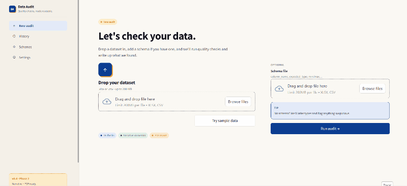

# AuditIQ

No-code CSV and Excel data quality audits for analysts, auditors, and teams that need a shareable report before analysis, submission, or review.

AuditIQ scans a tabular dataset, flags common quality issues, writes a plain-language narrative, and generates a downloadable PDF report. It works without an AI key by using a deterministic local narrative. If you add a Gemini API key, the report narrative can be generated by Gemini.


## What It Catches

- Missing values, empty rows, and high-null columns
- Duplicate rows and inferred duplicate keys
- Mixed types, invalid dates, and malformed identifiers
- Future dates and impossible numeric values
- Inconsistent casing, whitespace, and suspicious formats
- Outliers and high value concentration
- Cross-field issues such as start date after end date
- Optional schema violations for required columns, types, ranges, and formats

## Demo

The GIF below shows the local Streamlit flow: upload data, run checks, review the findings, and download a PDF.



## Expected Output

View a sample generated report: [Titanic PDF report](assets/sample-titanic-report.pdf).

## Quick Start

```bash
python -m venv .venv
.venv\Scripts\activate
pip install -r requirements.txt
streamlit run app.py
```

On macOS or Linux:

```bash
python -m venv .venv
source .venv/bin/activate
pip install -r requirements.txt
streamlit run app.py
```

Then click **Try sample data** to audit `samples/Titanic-Dataset.csv`.

## Optional Gemini Narrative

AuditIQ does not require an AI key to run. Without a key, it generates a deterministic narrative from the check results.

To enable Gemini-generated narratives, create a `.env` file in the project root:

```env
GEMINI_API_KEY=your_key_here
```

The app uses `gemini-2.5-flash-lite` by default.

## Schema Files

A schema file is optional. Upload a CSV or Excel file with this shape:

```csv
column_name,expected_type,min_value,max_value,allowed_formats,notes
Age,numeric,0,120,,
Embarked,text,,,,
PassengerId,identifier,,,^\d+$,Expected numeric identifier
```

Supported `expected_type` values are:

- `text`
- `numeric`
- `date`
- `identifier`

## Expected Output

For the included Titanic sample, the engine loads 891 rows and 12 columns and returns findings such as:

```text
Age: 177 blank or null values
Cabin: 687 blank or null values
Embarked: 2 blank or null values
```

The app then presents a quality score, issue summaries, a narrative explanation, and a downloadable PDF report.

## Run Tests

```bash
pip install -r requirements-dev.txt
pytest -q
```

## Project Structure

```text
AuditIQ/
|-- app.py                  # Streamlit app
|-- ai/
|   `-- narrator.py         # Gemini and deterministic narratives
|-- engine/
|   |-- parser.py           # CSV/XLSX loading
|   |-- aggregator.py       # Registry-driven check runner
|   |-- schema.py           # Optional schema loader
|   `-- checks/             # 18 inference checks plus schema checks
|-- report/
|   `-- pdf_builder.py      # PDF report generation
|-- samples/
|   `-- Titanic-Dataset.csv # Sample dataset
|-- styles/
|   `-- app.css             # Streamlit styling
|-- tests/
|   `-- engine/checks/      # Unit tests for check behavior
|-- requirements.txt
`-- requirements-dev.txt
```

## Quality Score

Each audit produces a score from 0 to 100:

```text
score = 100 - sum((affected_rows / total_rows) * severity_weight)
```

Severity weights:

- `bad` = 1.0
- `warn` = 0.6
- `info` = 0.2

Scores above 85 usually indicate minor issues. Scores below 60 indicate data quality problems that should be addressed before downstream use.

## Supported Files

- `.csv`
- `.xlsx`
- Tested with Python 3.11+
- Streamlit upload limit is configured as 200 MB in the UI copy

## Limitations

- AuditIQ loads the full dataset into memory after chunked CSV reading, so very large files still need enough RAM.
- The schema format is intentionally simple and does not replace full data contracts.
- AI narratives are optional and depend on external Gemini API availability when enabled.
- Results are heuristics for triage and review; they are not a substitute for domain-specific validation.

## License

MIT License. See `LICENSE`.
